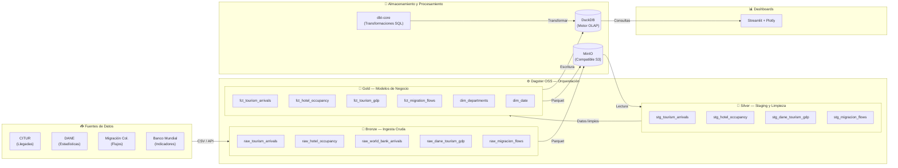
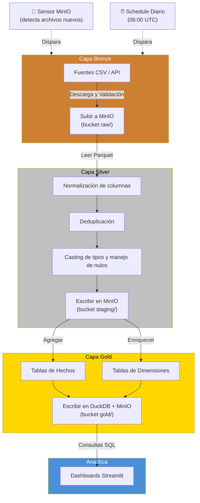
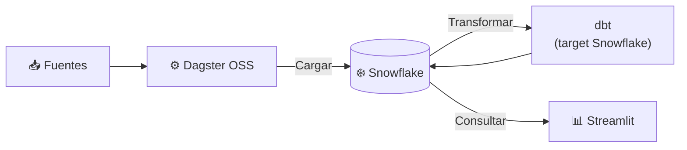
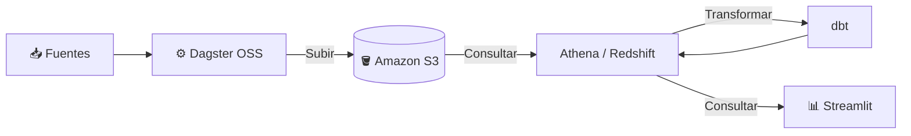

# 🇨🇴 Proyecto Nacional de Turismo — Colombia

**🌐 [Read in English](README.md)**

Proyecto de estudio y práctica de ingeniería de datos: un pipeline de extremo a extremo para analizar el turismo en Colombia, implementado en múltiples plataformas para explorar cómo se comporta el mismo flujo ETL en diferentes entornos.

> **🔓 100% Open Source** — La Fase 1 (local) utiliza exclusivamente herramientas de código abierto que cualquier persona puede instalar y ejecutar sin costo. Consulta la tabla de [stack tecnológico y licencias](#-stack-tecnológico-y-licencias) más abajo.

## 🎯 Objetivo

Explorar y aprender el **Modern Data Stack** a través de un caso de uso real: el análisis del turismo nacional colombiano. El mismo flujo ETL se implementa en distintas plataformas para comparar comportamiento, costo y rendimiento. El proyecto está abierto a cualquier persona que quiera aprender, experimentar o contribuir.

## 📊 Fuentes de Datos

| Fuente | Descripción | Formato |
|--------|-------------|---------|
| [CITUR](https://www.citur.gov.co) | Centro de Información Turística de Colombia — indicadores, llegadas, ocupación hotelera | CSV / API |
| [DANE](https://www.dane.gov.co) | Estadísticas nacionales — PIB turístico, empleo, encuestas de gasto | CSV / XLSX |
| [Migración Colombia](https://www.migracioncolombia.gov.co) | Flujos migratorios — entradas y salidas de viajeros por país | CSV |
| [MinCIT](https://www.mincit.gov.co) | Ministerio de Comercio — reportes de turismo receptivo y doméstico | PDF / CSV |
| [Banco Mundial Open Data](https://data.worldbank.org) | Indicadores internacionales de turismo | API / CSV |

## 🏗️ Arquitectura

### Fase 1: Stack Local Moderno (actual)



#### Detalle del Flujo de Datos



**Componentes (todos open-source):**

| Componente | Herramienta | Rol | Licencia |
|------------|-------------|-----|---------|
| Orquestación | Dagster OSS | Software-Defined Assets, sensores, schedules | Apache 2.0 |
| Almacenamiento | MinIO | Object store compatible con S3 (Bronze/Silver/Gold) | AGPL v3 |
| Procesamiento | DuckDB | Motor OLAP en proceso | MIT |
| Transformaciones | dbt-core | Modelado de datos en SQL (capas Medallion) | Apache 2.0 |
| Visualización | Streamlit + Plotly | Dashboards interactivos en Python | Apache 2.0 |
| Infraestructura | Docker Compose | Orquestación de contenedores | Apache 2.0 |

> ⚠️ **Nota:** Este proyecto usa **Dagster OSS** (el núcleo open-source, licencia Apache 2.0), **no** Dagster Cloud (el producto comercial de pago). Todo se ejecuta sin ningún servicio de pago.

### Fase 2: Snowflake (próxima)



- Migrar almacenamiento y procesamiento a Snowflake
- Mantener Dagster como orquestador
- dbt apuntando a Snowflake

### Fase 3: AWS / Cloud (futura)



- S3 + Redshift / Athena
- Posible integración con Databricks

## 📁 Estructura del Proyecto

```
National_Tourism_Project/
├── README.md                        # Versión en inglés
├── README.es.md                     # Este archivo (español)
├── dagster/                         # Orquestación con Dagster
│   ├── pyproject.toml
│   ├── setup.cfg
│   └── national_tourism/
│       ├── __init__.py
│       ├── definitions.py           # Punto de entrada de Dagster
│       ├── assets/                  # Software-Defined Assets
│       │   ├── ingestion/           # Bronze: 7 assets de ingesta
│       │   ├── staging/             # (Legacy — reemplazado por dbt SQL)
│       │   └── marts/               # (Legacy — reemplazado por dbt SQL)
│       ├── resources/               # Conexiones (MinIO, DuckDB)
│       ├── sensors/                 # Disparadores automáticos
│       └── schedules/               # Programación de ejecuciones
├── dbt/                             # Transformaciones con dbt
│   ├── dbt_project.yml
│   ├── profiles.yml
│   ├── packages.yml
│   ├── models/
│   │   ├── staging/                 # Silver: limpieza
│   │   ├── intermediate/            # Transformaciones intermedias
│   │   └── marts/                   # Gold: modelos de negocio
│   ├── seeds/                       # Datos de referencia (catálogos)
│   ├── tests/                       # Tests de calidad de datos
│   └── macros/                      # SQL reutilizable
├── docker/                          # Infraestructura containerizada
│   ├── docker-compose.yml
│   └── configs/                     # Archivos de configuración
├── infra/                           # Configuración por plataforma
│   ├── local/                       # Versión local (DuckDB + MinIO)
│   ├── snowflake/                   # Versión Snowflake
│   └── aws/                         # Versión AWS
├── dashboards/                      # Streamlit (app.py + requirements.txt)
├── data/                            # Datos de muestra
│   ├── raw/                         # Archivos descargados
│   └── seeds/                       # Catálogos y dimensiones
├── scripts/                         # Scripts auxiliares
├── docs/
│   └── GUIA_SETUP.md                    # Guía paso a paso (español)
├── .github/
│   └── workflows/                   # CI/CD
│       └── ci.yml
└── .gitignore
```

## 🔧 Arquitectura Medallion (Bronze → Silver → Gold)

| Capa | Descripción | Ejemplo |
|------|-------------|---------|
| **Bronze** (Raw) | Datos crudos tal como llegan de la fuente | CSV de CITUR sin transformar |
| **Silver** (Staging) | Datos limpios, tipados y estandarizados | Columnas renombradas, nulos manejados |
| **Gold** (Marts) | Modelos listos para análisis de negocio | `fct_tourism_arrivals`, `dim_departments` |

## 🚀 Inicio Rápido

### Prerrequisitos
- Docker & Docker Compose
- Python 3.11+
- Git

### Levantar el entorno local

```bash
# 1. Clonar el repositorio
git clone https://github.com/tu-usuario/National_Tourism_Project.git
cd National_Tourism_Project

# 2. Levantar servicios (MinIO, Dagster, Streamlit)
docker compose -f docker/docker-compose.yml up -d

# 3. Instalar dependencias de Python
pip install -e "dagster/.[dev]"

# 4. Instalar paquetes de dbt
cd dbt && dbt deps && cd ..

# 5. Abrir Dagster UI
# → http://localhost:3000

# 6. Abrir consola de MinIO
# → http://localhost:9001 (usuario: minioadmin / contraseña: minioadmin)

# 7. Abrir dashboards de Streamlit
# → http://localhost:8501
```

## 📈 Métricas Clave

- Llegadas de turistas internacionales por país de origen
- Ocupación hotelera por departamento
- Gasto promedio del turista
- Estacionalidad turística
- Contribución del turismo al PIB

## 🧪 Calidad de Datos

Se usan **dbt tests** para validar:
- Unicidad de claves primarias
- Campos críticos no nulos
- Integridad referencial entre tablas
- Rangos de valores válidos
- Tests personalizados de lógica de negocio

## 🔓 Stack Tecnológico y Licencias

| Herramienta | Rol | Licencia | Gratuita |
|-------------|-----|----------|----------|
| [Dagster OSS](https://github.com/dagster-io/dagster) | Orquestación | Apache 2.0 | ✅ Sí |
| [MinIO](https://github.com/minio/minio) | Almacenamiento S3 | AGPL v3 | ✅ Sí |
| [DuckDB](https://github.com/duckdb/duckdb) | Motor OLAP | MIT | ✅ Sí |
| [dbt-core](https://github.com/dbt-labs/dbt-core) | Transformaciones SQL | Apache 2.0 | ✅ Sí |
| [Streamlit](https://github.com/streamlit/streamlit) | Dashboards interactivos | Apache 2.0 | ✅ Sí |
| [Plotly](https://github.com/plotly/plotly.py) | Gráficas interactivas | MIT | ✅ Sí |
| [Docker](https://www.docker.com/) | Contenedores | Apache 2.0 | ✅ Sí |

> **Dagster OSS vs Dagster Cloud:** Este proyecto usa el núcleo open-source de Dagster,
> instalado con `pip install dagster`. Dagster Cloud es un servicio administrado de pago
> que **no** se necesita ni se usa aquí.

## 📨 Documentación adicional

- [📘 Guía Paso a Paso](docs/GUIA_SETUP.md) — Configuración detallada para principiantes
- [🇬🇧 English version](README.md) — This README in English

## 🤝 Contribuciones

¡Las contribuciones son bienvenidas! Para colaborar:

1. Haz **Fork** del repositorio
2. Crea una rama para tu feature: `git checkout -b feature/mi-mejora`
3. Haz commit de tus cambios: `git commit -m "Agregar mi mejora"`
4. Sube tu rama: `git push origin feature/mi-mejora`
5. Abre un **Pull Request**

### Ideas para contribuir
- 📊 Agregar nuevas fuentes de datos turísticos
- 🧪 Mejorar los tests de calidad de datos
- 🌍 Implementar una versión para otra plataforma (Databricks, BigQuery, etc.)
- 📈 Crear nuevos dashboards o visualizaciones
- 📝 Mejorar la documentación
- 🐛 Reportar bugs o sugerir mejoras vía [Issues](../../issues)

## 📝 Licencia

Licencia MIT — libre para uso educativo y colaborativo.
