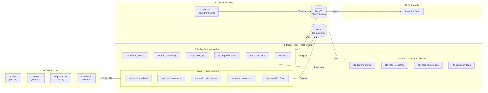
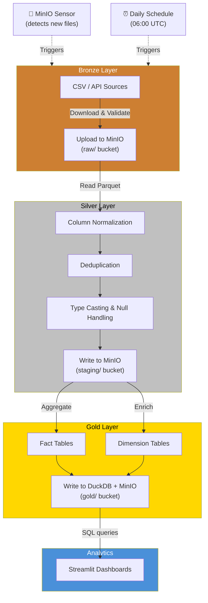
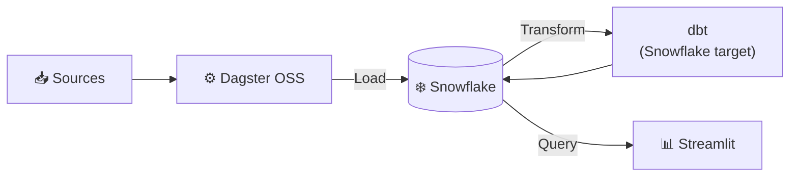
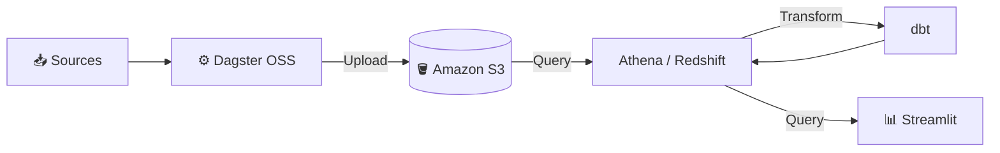

#National Tourism Project — Colombia

**🌐 [Leer en Español](README.es.md)**

A data engineering study and practice project: an end-to-end pipeline to analyze tourism in Colombia, implemented across multiple platforms to explore how the same ETL flow behaves in different environments.

> **🔓 100% Open Source** — Phase 1 (local) uses exclusively open-source tools that anyone can install and run at no cost. See the [tech stack & licenses](#-tech-stack--licenses) table below.

## 🎯 Goal

Explore and learn the **Modern Data Stack** through a real-world use case: the analysis of Colombian national tourism. The same ETL flow is implemented on different platforms to compare behavior, cost, and performance. The project is open to anyone who wants to learn, experiment, or contribute.

## 📊 Data Sources

| Source | Description | Format |
|--------|-------------|--------|
| [CITUR](https://www.citur.gov.co) | Colombian Tourism Information Center — indicators, arrivals, hotel occupancy | CSV / API |
| [DANE](https://www.dane.gov.co) | National statistics — tourism GDP, employment, spending surveys | CSV / XLSX |
| [Migración Colombia](https://www.migracioncolombia.gov.co) | Migration flows — traveler entries/exits by country | CSV |
| [MinCIT](https://www.mincit.gov.co) | Ministry of Commerce — inbound and domestic tourism reports | PDF / CSV |
| [World Bank Open Data](https://data.worldbank.org) | International tourism indicators | API / CSV |

## 🏗️ Architecture

### Phase 1: Local Modern Data Stack (current)



#### Data Flow Detail



**Components (all open-source):**

| Component | Tool | Role | License |
|-----------|------|------|---------|
| Orchestration | Dagster OSS | Software-Defined Assets, sensors, schedules | Apache 2.0 |
| Storage | MinIO | S3-compatible object store (Bronze/Silver/Gold) | AGPL v3 |
| Processing | DuckDB | In-process OLAP engine | MIT |
| Transforms | dbt-core | SQL-based data modeling (Medallion layers) | Apache 2.0 |
| Visualization | Streamlit + Plotly | Interactive Python-based dashboards | Apache 2.0 |
| Infrastructure | Docker Compose | Container orchestration | Apache 2.0 |

> ⚠️ **Note:** This project uses **Dagster OSS** (the open-source core, Apache 2.0 license), **not** Dagster Cloud (the paid commercial product). Everything runs without any paid services.

### Phase 2: Snowflake (next)



- Migrate storage and processing to Snowflake
- Keep Dagster as orchestrator
- dbt targeting Snowflake

### Phase 3: AWS / Cloud (future)



- S3 + Redshift / Athena
- Possible Databricks integration

## 📁 Project Structure

```
National_Tourism_Project/
├── README.md                        # This file (English)
├── README.es.md                     # Spanish version
├── dagster/                         # Orchestration with Dagster
│   ├── pyproject.toml
│   ├── setup.cfg
│   └── national_tourism/
│       ├── __init__.py
│       ├── definitions.py           # Dagster entry point
│       ├── assets/                  # Software-Defined Assets
│       │   ├── ingestion/           # Bronze: 7 ingestion assets
│       │   ├── staging/             # (Legacy — replaced by dbt SQL)
│       │   └── marts/               # (Legacy — replaced by dbt SQL)
│       ├── resources/               # Connections (MinIO, DuckDB)
│       ├── sensors/                 # Automatic triggers
│       └── schedules/               # Execution scheduling
├── dbt/                             # Transformations with dbt
│   ├── dbt_project.yml
│   ├── profiles.yml
│   ├── packages.yml
│   ├── models/
│   │   ├── staging/                 # Silver: cleaning
│   │   ├── intermediate/            # Intermediate transformations
│   │   └── marts/                   # Gold: business models
│   ├── seeds/                       # Reference data (catalogs)
│   ├── tests/                       # Data quality tests
│   └── macros/                      # Reusable SQL
├── docker/                          # Containerized infrastructure
│   ├── docker-compose.yml
│   └── configs/                     # Configuration files
├── infra/                           # Per-platform configuration
│   ├── local/                       # Local version (DuckDB + MinIO)
│   ├── snowflake/                   # Snowflake version
│   └── aws/                         # AWS version
├── dashboards/                      # Streamlit (app.py + requirements.txt)
├── data/                            # Sample raw data
│   ├── raw/                         # Downloaded files
│   └── seeds/                       # Catalogs & dimensions
├── scripts/                         # Helper scripts
├── docs/
│   └── GUIA_SETUP.md                    # Step-by-step setup guide (Spanish)
├── .github/
│   └── workflows/                   # CI/CD
│       └── ci.yml
└── .gitignore
```

## 🔧 Medallion Architecture (Bronze → Silver → Gold)

| Layer | Description | Example |
|-------|-------------|---------|
| **Bronze** (Raw) | Raw data as it arrives from the source | Untransformed CITUR CSV |
| **Silver** (Staging) | Clean, typed, and standardized data | Renamed columns, handled nulls |
| **Gold** (Marts) | Business-ready models for analysis | `fct_tourism_arrivals`, `dim_departments` |

## 🚀 Quick Start

### Prerequisites
- Docker & Docker Compose
- Python 3.11+
- Git

### Start the local environment

```bash
# 1. Clone the repository
git clone https://github.com/tu-usuario/National_Tourism_Project.git
cd National_Tourism_Project

# 2. Start services (MinIO, Dagster, Streamlit)
docker compose -f docker/docker-compose.yml up -d

# 3. Install Python dependencies
pip install -e "dagster/.[dev]"

# 4. Install dbt packages
cd dbt && dbt deps && cd ..

# 5. Open Dagster UI
# → http://localhost:3000

# 6. Open MinIO Console
# → http://localhost:9001 (user: minioadmin / password: minioadmin)

# 7. Open Streamlit dashboards
# → http://localhost:8501
```

## 📈 Key Metrics

- International tourist arrivals by country of origin
- Hotel occupancy by department
- Average tourist spending
- Tourism seasonality
- Tourism contribution to GDP

## 🧪 Data Quality

**dbt tests** are used to validate:
- Primary key uniqueness
- Not-null on critical fields
- Referential integrity between tables
- Valid value ranges
- Custom business logic tests

## 🔓 Tech Stack & Licenses

| Tool | Role | License | Free |
|------|------|---------|------|
| [Dagster OSS](https://github.com/dagster-io/dagster) | Orchestration | Apache 2.0 | ✅ Yes |
| [MinIO](https://github.com/minio/minio) | S3 Storage | AGPL v3 | ✅ Yes |
| [DuckDB](https://github.com/duckdb/duckdb) | OLAP Engine | MIT | ✅ Yes |
| [dbt-core](https://github.com/dbt-labs/dbt-core) | SQL Transformations | Apache 2.0 | ✅ Yes |
| [Streamlit](https://github.com/streamlit/streamlit) | Interactive Dashboards | Apache 2.0 | ✅ Yes |
| [Plotly](https://github.com/plotly/plotly.py) | Interactive Charts | MIT | ✅ Yes |
| [Docker](https://www.docker.com/) | Containers | Apache 2.0 | ✅ Yes |

> **Dagster OSS vs Dagster Cloud:** This project uses Dagster's open-source core,
> installed via `pip install dagster`. Dagster Cloud is a paid managed service
> that is **not** needed or used here.

## 📨 Additional Documentation

- [📘 Step-by-Step Setup Guide](docs/GUIA_SETUP.md) — Detailed setup instructions for beginners (Spanish)
- [🇪🇸 Versión en Español](README.es.md) — This README in Spanish

## 🤝 Contributing

Contributions are welcome! To collaborate:

1. **Fork** the repository
2. Create a feature branch: `git checkout -b feature/my-improvement`
3. Commit your changes: `git commit -m "Add my improvement"`
4. Push to your branch: `git push origin feature/my-improvement`
5. Open a **Pull Request**

### Ideas for contributions
- 📊 Add new tourism data sources
- 🧪 Improve data quality tests
- 🌍 Implement a version for another platform (Databricks, BigQuery, etc.)
- 📈 Create new dashboards or visualizations
- 📝 Improve documentation
- 🐛 Report bugs or suggest improvements via [Issues](../../issues)

## 📝 License

MIT License — free for educational and collaborative use.
